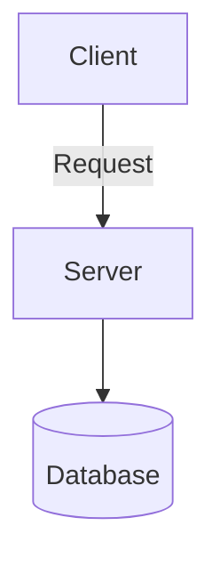

# Post Title

_Posted on 2025-04-10_

[TOC]

---

> **NOTE**: This post is part of the 'My Dev Journey' series.
> 🔗 [Previous Post](./previous-post-slug.md) ｜ [Next Post](./next-post-slug.md)

## 🧭 Introduction

Short overview of this post

## ❓ Problem Statement

Describe the context or challenge you faced

## 💡 Design & Solution

- Trade-offs considered
- System overview

### 🗺️ Mermaid Diagram


### 🧮 Math Expression (LaTeX)
$$
E = mc^2
$$

## 💻 Sample Code
```language
// your code here
```

## 🔍 Reflections & Learnings

- What went well, what to improve next time

---

_Thanks for reading!_
[Back to top](#Post Title)