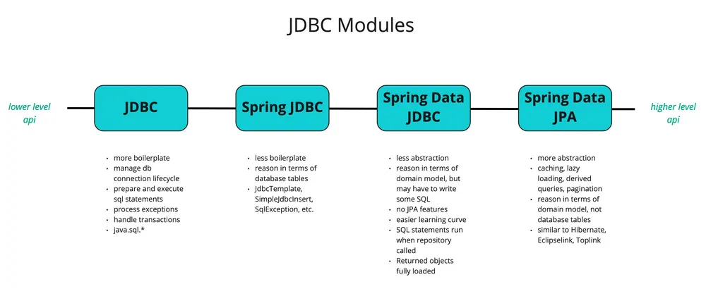

# java spring jdbc




Spring Boot 프로젝트에서 spring-session-jdbc, spring-boot-starter-data-jdbc, spring-boot-starter-jdbc의 역할과 사용처를 설명해 드리겠습니다.

---

**1️⃣ org.springframework.session:spring-session-jdbc**

**✅ 기능:**

• **Spring Session을 JDBC 기반으로 저장**할 수 있도록 해주는 라이브러리입니다.

• 기본적으로 **세션 데이터를 데이터베이스(DB)**에 저장하며, **서버 재시작 시에도 세션 유지**가 가능합니다.

**✅ 사용처:**

• **분산 환경**에서 여러 서버 간 세션을 공유할 때 사용

• **스프링 부트 내장 세션 저장소**(기본 In-Memory) 대신 **데이터베이스 기반 세션 저장**이 필요할 때

**✅ 사용 예시 (application.yml 설정)**

```js
spring:
  session:
    store-type: jdbc  # JDBC 기반 세션 저장소 사용
  datasource:
    url: jdbc:mysql://localhost:3306/mydb
    username: user
    password: pass
```

📌 **활용 예시**

세션을 관리하는 서비스에서 HTTP 세션을 **DB에 저장**하여 여러 인스턴스에서 세션을 공유할 때 사용합니다.

```java
@Controller
public class SessionController {
    @GetMapping("/session")
    public String getSession(HttpSession session) {
        session.setAttribute("username", "john_doe");
        return "Session stored in DB!";
    }
}
```

---

**2️⃣ org.springframework.boot:spring-boot-starter-data-jdbc**

**✅ 기능:**

• **Spring Data JDBC**를 사용하여 데이터베이스 접근을 간편하게 처리

• Spring Data JPA와 달리, **JDBC 기반으로 단순한 CRUD 작업에 최적화**됨

• **JPA보다 가벼운 데이터 액세스 계층을 만들 때 유용**

**✅ 사용처:**

• JPA(Hibernate)를 사용하지 않고, 가볍게 JDBC를 활용할 때

• 복잡한 엔티티 매핑 없이 간단한 **Repository 패턴 기반 데이터 접근**이 필요할 때

**✅ 사용 예시 (Repository 패턴)**

```python
@Repository
public interface UserRepository extends CrudRepository<User, Long> {
    List<User> findByUsername(String username);
}
```

📌 **활용 예시**

JPA 대신 JDBC 기반의 **간단한 CRUD 처리를 할 때** 유용합니다.

```rust
@Service
public class UserService {
    private final JdbcTemplate jdbcTemplate;

    public UserService(JdbcTemplate jdbcTemplate) {
        this.jdbcTemplate = jdbcTemplate;
    }

    public List<User> findAllUsers() {
        return jdbcTemplate.query("SELECT * FROM users", (rs, rowNum) ->
                new User(rs.getLong("id"), rs.getString("username")));
    }
}
```

---

**3️⃣ org.springframework.boot:spring-boot-starter-jdbc**

**✅ 기능:**

• **JDBC 기반 데이터베이스 연결 및 SQL 실행을 위한 기본적인 설정**을 제공

• DataSource, JdbcTemplate 등을 포함하여 **SQL 직접 실행 가능**

• spring-boot-starter-data-jdbc보다 더 로우 레벨의 JDBC 사용 가능

**✅ 사용처:**

• Spring Boot에서 **JDBC를 직접 사용**할 때

• JdbcTemplate을 활용하여 SQL을 직접 실행해야 할 때

• ORM(JPA) 없이, SQL을 직접 사용해야 할 때

**✅ 사용 예시 (JdbcTemplate 활용)**

```c++
@Autowired
private JdbcTemplate jdbcTemplate;

public void insertUser(String username) {
    jdbcTemplate.update("INSERT INTO users (username) VALUES (?)", username);
}
```

📌 **활용 예시**

• **ORM 없이 SQL을 직접 실행**해야 하는 경우

• 빠른 SQL 실행이 필요한 경우 (JOIN, GROUP BY 등 최적화가 필요할 때)

---

**📌 정리**

| **라이브러리**                | **역할**              | **언제 사용?**                                |
| ----------------------------- | --------------------- | --------------------------------------------- |
| spring-session-jdbc           | 세션을 DB에 저장      | 세션을 유지하면서 서버 간 공유해야 할 때      |
| spring-boot-starter-data-jdbc | Spring Data JDBC 지원 | JPA 없이 간단한 Repository 패턴을 사용할 때   |
| spring-boot-starter-jdbc      | 기본 JDBC 지원        | SQL을 직접 실행해야 할 때 (JdbcTemplate 활용) |

---

**🚀 어떤 경우에 무엇을 사용해야 할까요?**

• **Spring Boot 기본 JDBC 사용** → spring-boot-starter-jdbc

• **Repository 기반 간단한 CRUD** → spring-boot-starter-data-jdbc

• **서버 간 세션 공유 & 유지** → spring-session-jdbc

---

**📢 결론**

• spring-boot-starter-jdbc는 **기본 JDBC 지원**을 위한 라이브러리입니다.

• spring-boot-starter-data-jdbc는 **Spring Data JDBC 기반의 Repository 패턴을 쉽게 적용**할 수 있도록 합니다.

• spring-session-jdbc는 **세션 데이터를 DB에 저장하여 관리**하는 데 사용됩니다.

이제 프로젝트의 목적에 맞게 적절한 라이브러리를 선택하시면 됩니다! 😊

## Test h2 header
